---

## 🛡️ Offensive Security (in progress) | 🖥️ IT Support Specialist | 🧠 Building CoreSec Group

---

## 🧑‍💻 About Me

💼 IT Support Specialist based in Cape Town, South Africa  
⚡ ~3 years across freelance consulting, LBB Foods, and Individual Zone Solutions  
🎯 Transitioning into offensive security & penetration testing  
📚 Working toward **eJPT** — foundations covered via CompTIA A+ study and Security+ material  
🏴 Active on TryHackMe (OSINT, web exploitation, Active Directory) and HTB  
🐛 Bug bounty hunter on Bugcrowd  
🏢 Founder of **CoreSec Group (Pty) Ltd**  
♟️ Also cooking up code (and food — I moonlight as a cook at Gordon's Sweets)

---

## 🛠️ Currently Building

- **[Hermes](#)** — a multi-agent cybersecurity system: Flask/SSE backend, a 754-skill security library, DeepSeek-R1 via OpenRouter, with an in-progress "Selene OS" Next.js/React dashboard (voice interaction, live waveform, SSE streaming). Deployed on a Hetzner VPS with Tailscale.
- **[CoreSec Group website](#)** — five-page static site for my consultancy, dark mode, Space Grotesk / IBM Plex typography.
- **Pentest toolkit** — a growing set of recon/automation scripts (`netcheck.sh`, `ufw-profile.sh`, and others) built for my own lab workflow.

---

## 🖥️ Cyber Projects & Portfolio

🖥️ **[cyber-portfolio](https://github.com/kyletawa/cyber-portfolio)**
Cybersecurity portfolio site with CTF writeups, labs, tools, and projects.

🧰 **[pentest-toolkit](https://github.com/kyletawa/pentest-toolkit)**
My personal toolkit repo — recon scripts, reverse shell generators, and utilities for every box.

📝 **[kyle-exe-blog](https://github.com/kyletawa/kyle-exe-blog)**
Blog with CTF writeups, cybersecurity tutorials, and IT field notes.

🏢 **[coresec-group-website](https://github.com/kyletawa/coresec-group-website)**
Company site for CoreSec Group — secure systems, IT support, and consulting.

---

## 🏴 Recent CTF & Lab Work

🔓 **Bug Bounty — Code.org (Bugcrowd)**
First live bounty submission. Found admin route enumeration and a Rails debug-mode disclosure (`config.consider_all_requests_local = true`), wrote it up as a P3 with full CVSS scoring and RFC references.

🧰 **[pentest-toolkit](https://github.com/kyletawa/pentest-toolkit)**
My personal toolkit repo — recon scripts, reverse shell generators, and the utilities I reach for on every box.

🌐 **[kyle-portfolio](https://kyletawa.github.io/kyle-portfolio/)**
My terminal-themed portfolio site built with React + Vite — live on GitHub Pages.

📄 **CTF Write-Up Portfolio**
Documented walkthroughs across All In One, Pickle Rick, Fowsniff, Takeover, and Mr. Robot.
[All In One](ctf-writeups/thm-all-in-one.md) · [Pickle Rick](ctf-writeups/thm-pickle-rick.md) · [Fowsniff](ctf-writeups/thm-fowsniff.md) · [Takeover](ctf-writeups/thm-takeover.md) · [Mr. Robot](ctf-writeups/thm-mr-robot.md)

🎭 **[Social Engineering Toolkit](social-engineering-toolkit.html)**
A single-file HTML app covering common social engineering attack scenarios and awareness training.

🍬 **Gordon's Sweets**
Freelance portfolio site built for a Cape Town candy manufacturer — full design-to-deploy client project.

---

### `$ tech --arsenal`

 

---

### `$ status --stats`

---

### `$ roadmap --2026`

- [ ] Pass **CompTIA Security+**
- [ ] Pass **eJPT**
- [ ] Progress into broader-scope bounty programs (Web.com, TripAdvisor)
- [ ] Keep shipping Selene OS — open-source what's safe to share
- [ ] Document every box, every time

---

### `$ connect --me`

---

`# whoami: support specialist by day, breaking things (responsibly) by night`

